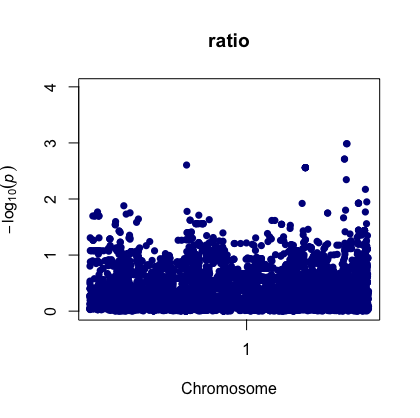

# From SNPs to phenotype: Genome-Wide Association Study (GWAS) pipeline

[](https://snakemake.bitbucket.io)
[](https://travis-ci.org/snakemake-workflows/gwas)

# Description
A Snakemake pipeline to perform a Genome Wide Analysis (GWAS) using genetic variant (Variant Call Format) and phenotype information.

This Snakemake pipeline will:
- Perform a Random Forest analysis using the R `ranger` package to identify SNPs important for the phenotype of interest.
- Perform a canonical GWAS analysis using the `RainbowR` package.  
 
<!-- MarkdownTOC autolink="true" levels="1,2" -->

- [Inputs and outputs](#inputs-and-outputs)
	- [Inputs](#inputs)
	- [Outputs](#outputs)
- [Example datasets](#example-datasets)
	- [2.1 VCF dataset](#21-vcf-dataset)
	- [2.2 Phenotypes](#22-phenotypes)
- [Installation](#installation)
	- [Install RStudio](#install-rstudio)
	- [Clone the repository](#clone-the-repository)
	- [Run the gwas.R script](#run-the-gwasr-script)
- [References](#references)
	- [:writing\_hand: Authors](#writing_hand-authors)
	- [RainbowR](#rainbowr)
	- [Ranger package](#ranger-package)

<!-- /MarkdownTOC -->

# Inputs and outputs

## Inputs

### VCF file 
A [Variant Call Format (VCF)](https://en.wikipedia.org/wiki/Variant_Call_Format) file that contains the nucleotidic variations is needed. The VCF file has to be of version 4.0 and higher. It will be converted to a genotype matrix using [VCFtools](https://vcftools.github.io/man_latest.html) where genotypes are represented by:
- "0" for genome positions homozygous for the reference allele.
- "2" for genome positions homozygous for the alternative allele.
- "1" for genome positions heterozygous (one reference allele, one alternative allele).

The first column should contain the identifier for each individual (e.g. plant accessions).

The example 
```
vcftools --vcf Arabidopsis_2029_Maf001_Filter80.1000lines.vcf --012 --out vcf_parsed/test


# to remove the first row numbers in the test.012 file
awk 'BEGIN{FS=OFS="\t"}{$1="";sub("\t","")}1' test.012

#   
```

### Phenotype file
A tabulated separated file containing two columns:


## Outputs

This pipeline will generate several GWAS output such as:

### Manhattan plot
 


# Example datasets

All input data are to be found in `data/`.

## 2.1 VCF dataset
The VCF data from a study from [Arouisse et al. 2019](https://onlinelibrary.wiley.com/doi/full/10.1111/tpj.14659).

The VCF file itself can be downloaded directly from [FigShare (file is called "Arabidopsis_2029_Maf001_Filter80")](https://figshare.com/projects/Imputation_of_3_million_SNPs_in_the_Arabidopsis_regional_mapping_population/72887).

_Test file_: a small subset of the massive initial VCF file is available for testing purposes. It can be found at `data/Arabidopsis_2029_Maf001_Filter80.1000lines.vcf`.


## 2.2 Phenotypes
Describe origin of phenotype data here...


# Installation 

## Install RStudio
If not already done, install [R (version >= 3.5)](https://www.r-project.org/) and [RStudio](https://rstudio.com/) for your Operating System. 

## Clone the repository
1. Open RStudio. 
2. Select "File > New Project". 
3. Select 


## Run the gwas.R script
Open RStudio and the `gwas.R` script located in `scripts/`.

# References 

## :writing\_hand: Authors

* Marc Galland (@mgalland)
* Martha van Os (@MvanOs)
* Machiel Clige (@BertusMuscari)

## RainbowR
The [RAINBOWR R](https://doi.org/10.1371/journal.pcbi.1007663) package was used to perform GWAS analysis.  

## Ranger package

